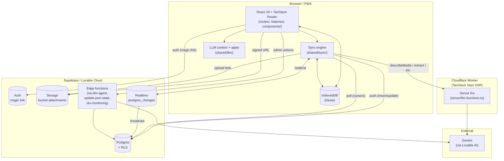
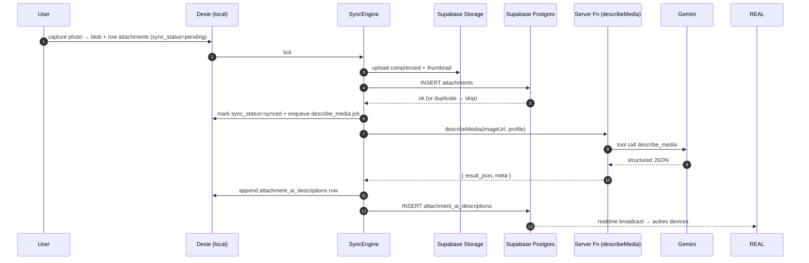

# VTU — Codemap

> Carte vivante de l'application. **Toujours mise à jour à chaque PR** qui ajoute, déplace ou supprime un fichier.
>
> Objectif : que n'importe qui (humain, Claude, Lovable) puisse répondre en 30s à
> « pour modifier la feature X, quels fichiers je touche ? » sans relire tout le code.
>
> Pour la philosophie produit + règles immuables : voir [KNOWLEDGE.md](./KNOWLEDGE.md).

---

## Table des matières

1. [Vue d'ensemble (graphe)](#1-vue-densemble-graphe)
2. [Stack & runtime](#2-stack--runtime)
3. [Index par domaine fonctionnel](#3-index-par-domaine-fonctionnel)
   - [3.1 Auth](#31-auth)
   - [3.2 Visits](#32-visits)
   - [3.3 Chat](#33-chat)
   - [3.4 Photos & pièces jointes](#34-photos--pièces-jointes)
   - [3.5 JSON State](#35-json-state)
   - [3.6 LLM (extract / conversational / describe_media / router)](#36-llm-extract--conversational--describe_media--router)
   - [3.7 Sync (push + pull + realtime)](#37-sync-push--pull--realtime)
   - [3.8 Admin & monitoring](#38-admin--monitoring)
   - [3.9bis Domain — nomenclatures métier](#39bis-domain--nomenclatures-métier)
   - [3.9 Debug & dev tools](#39-debug--dev-tools)
4. [Schéma DB & migrations](#4-schéma-db--migrations)
5. [Edge functions Supabase](#5-edge-functions-supabase)
6. [Server functions TanStack](#6-server-functions-tanstack)
7. [Routes & navigation](#7-routes--navigation)
8. [UI & design system](#8-ui--design-system)
9. [Tests](#9-tests)
10. [Bugs & dette technique connus](#10-bugs--dette-technique-connus)
11. [Conventions de mise à jour](#11-conventions-de-mise-à-jour)

---

## 1. Vue d'ensemble (graphe)



**Flux critique « envoi photo + analyse IA »** (à connaître par cœur avant toute modif sur cette zone) :



---

## 2. Stack & runtime

| Couche | Tech | Fichier de référence |
|---|---|---|
| Build / dev | Vite 7 + bun | [vite.config.ts](./vite.config.ts), [package.json](./package.json) |
| Hosting | Cloudflare Workers (TanStack Start) | [wrangler.jsonc](./wrangler.jsonc) |
| Frontend | React 19 + TanStack Router file-based | [src/routes/](./src/routes/) |
| State serveur | TanStack Query v5 | (utilisé localement par hook) |
| State global | Zustand v5 | [src/features/auth/store.ts](./src/features/auth/store.ts), [src/features/chat/store.ts](./src/features/chat/store.ts) |
| Local DB | Dexie 4 (IndexedDB) | [src/shared/db/schema.ts](./src/shared/db/schema.ts) |
| UI | shadcn/ui + Tailwind 4 | [src/components/ui/](./src/components/ui/), [src/design-tokens.ts](./src/design-tokens.ts) |
| Backend | Supabase (Postgres + Auth + Storage + Realtime + Edge Fns) | [supabase/](./supabase/) |
| LLM | Gemini Flash/Pro via Lovable AI Gateway | [src/shared/llm/providers/lovable-gemini.ts](./src/shared/llm/providers/lovable-gemini.ts) |
| Tests | Vitest + Testing Library + fake-indexeddb | [vitest.config.ts](./vitest.config.ts), [vitest.e2e.config.ts](./vitest.e2e.config.ts) |

---

## 3. Index par domaine fonctionnel

### 3.1 Auth

**But** : magic-link Supabase, route guard, expose `userId` aux features.

| Rôle | Fichier |
|---|---|
| Store global (user, session) | [src/features/auth/store.ts](./src/features/auth/store.ts) |
| Index public | [src/features/auth/index.ts](./src/features/auth/index.ts) |
| Route login | [src/routes/login.tsx](./src/routes/login.tsx) |
| Route callback magic-link | [src/routes/auth.callback.tsx](./src/routes/auth.callback.tsx) |
| Layout authentifié (guard) | [src/routes/_authenticated.tsx](./src/routes/_authenticated.tsx) |
| Client Supabase navigateur | [src/integrations/supabase/client.ts](./src/integrations/supabase/client.ts) |
| Client Supabase serveur (SSR) | [src/integrations/supabase/client.server.ts](./src/integrations/supabase/client.server.ts) |
| Middleware server fn (⚠️ **pas câblée**, voir §10) | [src/integrations/supabase/auth-middleware.ts](./src/integrations/supabase/auth-middleware.ts) |
| Tests | [src/features/auth/__tests__/](./src/features/auth/__tests__/) |

**Tables touchées** : `auth.users` (Supabase géré), `user_roles`.

---

### 3.2 Visits

**But** : CRUD visites thermiques, sidebar listing, drawer unifié de présentation.

| Rôle | Fichier |
|---|---|
| Repo Dexie + push outbox | [src/shared/db/visits.repo.ts](./src/shared/db/visits.repo.ts) |
| Sidebar liste visites | [src/features/visits/components/VisitsSidebar.tsx](./src/features/visits/components/VisitsSidebar.tsx) |
| Carte visite (item) | [src/features/visits/components/VisitCard.tsx](./src/features/visits/components/VisitCard.tsx) |
| Création visite (dialog) | [src/features/visits/components/NewVisitDialog.tsx](./src/features/visits/components/NewVisitDialog.tsx) |
| Drawer unifié (résumé / photos / actions / export) | [src/features/visits/components/UnifiedVisitDrawer.tsx](./src/features/visits/components/UnifiedVisitDrawer.tsx) |
| Tab résumé | [src/features/visits/components/VisitSummaryView.tsx](./src/features/visits/components/VisitSummaryView.tsx) |
| Tab photos | [src/features/visits/components/PhotosTab.tsx](./src/features/visits/components/PhotosTab.tsx) |
| Tab actions IA | [src/features/visits/components/AiActionsTab.tsx](./src/features/visits/components/AiActionsTab.tsx) |
| Tab export email | [src/features/visits/components/ExportEmailTab.tsx](./src/features/visits/components/ExportEmailTab.tsx) |
| Tab export Monday | [src/features/visits/components/ExportMondayTab.tsx](./src/features/visits/components/ExportMondayTab.tsx) |
| Tab Mapbox | [src/features/visits/components/MapboxTab.tsx](./src/features/visits/components/MapboxTab.tsx) |
| Coming-soon panel | [src/features/visits/components/ComingSoonPanel.tsx](./src/features/visits/components/ComingSoonPanel.tsx) |
| Lib (grouping, search, summary) | [src/features/visits/lib/](./src/features/visits/lib/) |
| Route principale d'une visite | [src/routes/_authenticated/visits.$visitId.tsx](./src/routes/_authenticated/visits.$visitId.tsx) |
| Index | [src/features/visits/index.ts](./src/features/visits/index.ts) |
| Tests | [src/features/visits/__tests__/](./src/features/visits/__tests__/) |

**Tables touchées** : `visits` (postgres + Dexie mirror).
**Server fn / Edge fn** : aucune directe (passe par sync engine).

---

### 3.3 Chat

**But** : conversation par visite — messages texte, photos, voix (Phase 3+), cards IA (actions, conflits, batch progress).

| Rôle | Fichier |
|---|---|
| Store (AI on/off per visit, draft text) | [src/features/chat/store.ts](./src/features/chat/store.ts) |
| Repo Dexie + enqueue message | [src/shared/db/messages.repo.ts](./src/shared/db/messages.repo.ts) |
| Liste de messages (UI) | [src/features/chat/components/MessageList.tsx](./src/features/chat/components/MessageList.tsx) |
| Input bar (texte + attachements) | [src/features/chat/components/ChatInputBar.tsx](./src/features/chat/components/ChatInputBar.tsx) |
| Sheet "joindre une PJ" | [src/features/chat/components/AttachmentSheet.tsx](./src/features/chat/components/AttachmentSheet.tsx) |
| Affichage attachments dans bulle | [src/features/chat/components/MessageAttachments.tsx](./src/features/chat/components/MessageAttachments.tsx) |
| Lightbox image | [src/features/chat/components/MediaLightbox.tsx](./src/features/chat/components/MediaLightbox.tsx) |
| Preview avant envoi | [src/features/chat/components/PhotoPreviewPanel.tsx](./src/features/chat/components/PhotoPreviewPanel.tsx) |
| Carte progression batch photo (par-message, transitoire) | [src/features/chat/components/PhotoBatchProgressCard.tsx](./src/features/chat/components/PhotoBatchProgressCard.tsx) ⚠️ **dead code** depuis 9e91186 |
| Statut pièces jointes par-VT (persistant) | [src/features/chat/components/VisitAttachmentSyncStatus.tsx](./src/features/chat/components/VisitAttachmentSyncStatus.tsx) |
| Carte propositions IA (Apply/Ignore) | [src/features/chat/components/PendingActionsCard.tsx](./src/features/chat/components/PendingActionsCard.tsx) |
| Carte conflits IA vs humain | [src/features/chat/components/ConflictCard.tsx](./src/features/chat/components/ConflictCard.tsx) |
| Hook resolver thumbnail (blob OU signed URL, états détaillés) | [src/features/chat/lib/useAttachmentThumb.ts](./src/features/chat/lib/useAttachmentThumb.ts) |
| Hook état IA par-attachment (queued/running/done/failed/disabled) | [src/features/chat/lib/useAttachmentAiState.ts](./src/features/chat/lib/useAttachmentAiState.ts) |
| Hook "LLM pending" (route + dispatch + describe en cours) | [src/features/chat/lib/useLlmPending.ts](./src/features/chat/lib/useLlmPending.ts) |
| Time helpers | [src/features/chat/lib/relativeTime.ts](./src/features/chat/lib/relativeTime.ts) |
| Index | [src/features/chat/index.ts](./src/features/chat/index.ts) |
| Tests | [src/features/chat/__tests__/](./src/features/chat/__tests__/) |

**Tables touchées** : `messages` (append-only), `attachments`, `attachment_ai_descriptions`.
**Server fn appelée** : `extractFromMessage`, `conversationalQuery`, `routeMessageLlm`, `describeMedia` (via sync engine).
**Invariants** :
- Messages **append-only** (pas d'UPDATE/DELETE en DB).
- `kind ∈ { text, audio, photo, document, system_event }` (⚠️ `actions_card`, `conflict_card` écrits par le code mais **rejetés par la contrainte DB** — voir §10).

---

### 3.4 Photos & pièces jointes

**But** : capture, compression, déduplication, upload Storage, hydration cross-device.

| Rôle | Fichier |
|---|---|
| Compression image client-side | [src/shared/photo/compress.ts](./src/shared/photo/compress.ts) |
| Lecture EXIF (GPS, orientation) | [src/shared/photo/exif.ts](./src/shared/photo/exif.ts) |
| Heuristiques (plan vs photo, etc.) | [src/shared/photo/heuristics.ts](./src/shared/photo/heuristics.ts) |
| Hash sha256 (dédup) | [src/shared/photo/sha256.ts](./src/shared/photo/sha256.ts) |
| Repo local (création attachment + blob) | [src/shared/photo/repo.ts](./src/shared/photo/repo.ts) |
| Repo upsert depuis remote (cross-device pull) | [src/shared/db/attachments.repo.ts](./src/shared/db/attachments.repo.ts) |
| Repo descriptions IA (append-only, latest-by-attachment) | [src/shared/db/attachment-ai-descriptions.repo.ts](./src/shared/db/attachment-ai-descriptions.repo.ts) |
| Resolver thumbnail (blob → signed URL → backfill) | [src/features/chat/lib/useAttachmentThumb.ts](./src/features/chat/lib/useAttachmentThumb.ts) |
| Upload Storage + INSERT row + enqueue describe_media | [src/shared/sync/engine.ts](./src/shared/sync/engine.ts) (sections `processAttachmentUpload`, `enqueueDescribeMediaIfNeeded`) |
| Pull cross-device (rows) | [src/shared/sync/pull.ts](./src/shared/sync/pull.ts) (`pullAttachmentsForVisit`, `pullAttachmentAiDescriptionsForVisit`) |
| Index | [src/shared/photo/index.ts](./src/shared/photo/index.ts) |
| Tests | [src/shared/photo/__tests__/](./src/shared/photo/__tests__/), [src/shared/sync/__tests__/engine.attachment-upload.test.ts](./src/shared/sync/__tests__/engine.attachment-upload.test.ts) |

**Tables touchées** : `attachments`, `attachment_ai_descriptions` (Dexie + Postgres + Storage bucket `attachments`).
**Storage path convention** : `{user_id}/{visit_id}/{filename}` — RLS Storage filtre sur `(storage.foldername(name))[1] = auth.uid()`.
**Invariants** :
- Blob local **non synchronisé cross-device** — l'autre device passe par signed URL Storage + backfill Dexie.
- `compressed_path` préféré à `thumbnail_path` (cf. logique `useAttachmentThumb`).

---

### 3.5 JSON State

**But** : source de vérité versionnée de l'état d'une visite. Append-only (chaque mutation crée une nouvelle version).

| Rôle | Fichier |
|---|---|
| Type principal | [src/shared/types/json-state.ts](./src/shared/types/json-state.ts) |
| Sections par domaine (chauffage, ECS, ENV, etc.) | [src/shared/types/json-state.sections.ts](./src/shared/types/json-state.sections.ts) |
| Champ générique `Field<T>` (value, source, validation_status, …) | [src/shared/types/json-state.field.ts](./src/shared/types/json-state.field.ts) |
| Custom fields (registry-driven) | [src/shared/types/json-state.custom-field.ts](./src/shared/types/json-state.custom-field.ts) |
| Bornes / validation | [src/shared/types/json-state.bounds.ts](./src/shared/types/json-state.bounds.ts) |
| Factory (état initial pour un mission_type) | [src/shared/types/json-state.factory.ts](./src/shared/types/json-state.factory.ts) |
| Migrations de schéma | [src/shared/types/json-state.migrate.ts](./src/shared/types/json-state.migrate.ts) |
| Repo Dexie / push | [src/shared/db/json-state.repo.ts](./src/shared/db/json-state.repo.ts) |
| Repo validation bulk | [src/shared/db/json-state.validate.repo.ts](./src/shared/db/json-state.validate.repo.ts) |
| Application des patches IA | [src/shared/llm/apply/apply-patches.ts](./src/shared/llm/apply/apply-patches.ts) |
| Application des custom_fields IA | [src/shared/llm/apply/apply-custom-fields.ts](./src/shared/llm/apply/apply-custom-fields.ts) |
| Logique de conflits (humain prime) | [src/features/json-state/lib/conflicts.ts](./src/features/json-state/lib/conflicts.ts) |
| Inspection (debug) | [src/features/json-state/lib/inspect.ts](./src/features/json-state/lib/inspect.ts) |
| Panel viewer | [src/features/json-state/components/JsonStatePanel.tsx](./src/features/json-state/components/JsonStatePanel.tsx) |
| Drawer viewer | [src/features/json-state/components/JsonViewerDrawer.tsx](./src/features/json-state/components/JsonViewerDrawer.tsx) |
| Edge fn applique patches côté serveur | [supabase/functions/update-json-state/index.ts](./supabase/functions/update-json-state/index.ts) |
| Index | [src/features/json-state/index.ts](./src/features/json-state/index.ts) |
| Tests | [src/features/json-state/__tests__/](./src/features/json-state/__tests__/), [src/shared/db/__tests__/json-state-validate*.test.ts](./src/shared/db/__tests__/) |

**Tables touchées** : `visit_json_state` (PK = `(visit_id, version)`, immuable par version).
**Invariants** :
- Pas d'UPDATE en place. Toute modif crée une version `N+1`.
- Conflict gate : si `state[path].source ∈ {user, voice, photo_ocr, import}` et `validation_status = "validated"`, **l'IA ne peut pas écraser**.

---

### 3.6 LLM (extract / conversational / describe_media / router)

**But** : 4 modes d'invocation Gemini, tous via server functions TanStack côté Worker.

| Rôle | Fichier |
|---|---|
| Provider Gemini (HTTP gateway Lovable AI) | [src/shared/llm/providers/lovable-gemini.ts](./src/shared/llm/providers/lovable-gemini.ts) |
| Client edge function | [src/shared/llm/providers/edge-function-client.ts](./src/shared/llm/providers/edge-function-client.ts) |
| Server fns (entry-point unique côté serveur) | [src/server/llm.functions.ts](./src/server/llm.functions.ts) |
| Builders prompts utilisateur (extract/conversational) | [src/server/llm.prompt-builders.ts](./src/server/llm.prompt-builders.ts) |
| Prompt système — extract | [src/shared/llm/prompts/system-extract.ts](./src/shared/llm/prompts/system-extract.ts) |
| Prompt système — conversational | [src/shared/llm/prompts/system-conversational.ts](./src/shared/llm/prompts/system-conversational.ts) |
| Prompt système — describe_media | [src/shared/llm/prompts/system-describe-media.ts](./src/shared/llm/prompts/system-describe-media.ts) |
| Prompt système — router (rare fallback) | [src/shared/llm/prompts/system-router.ts](./src/shared/llm/prompts/system-router.ts) |
| Prompt système — unified (Phase 2 expérimental) | [src/shared/llm/prompts/system-unified.ts](./src/shared/llm/prompts/system-unified.ts) |
| Index prompts | [src/shared/llm/prompts/index.ts](./src/shared/llm/prompts/index.ts) |
| Schémas Zod sortie LLM | [src/shared/llm/schemas/](./src/shared/llm/schemas/) |
| Builder du `ContextBundle` (pure) | [src/shared/llm/context/builder.ts](./src/shared/llm/context/builder.ts) |
| Compresseur context (réduction si gros) | [src/shared/llm/context/compress.ts](./src/shared/llm/context/compress.ts) |
| Hash stable (cache observability) | [src/shared/llm/context/hash.ts](./src/shared/llm/context/hash.ts) |
| Sérialisation stable | [src/shared/llm/context/serialize-stable.ts](./src/shared/llm/context/serialize-stable.ts) |
| Estimation tokens | [src/shared/llm/context/tokens-estimate.ts](./src/shared/llm/context/tokens-estimate.ts) |
| Router déterministe (regex avant LLM) | [src/shared/llm/router.ts](./src/shared/llm/router.ts) |
| Path labels (humanisation FR) | [src/shared/llm/path-labels.ts](./src/shared/llm/path-labels.ts) |
| Types partagés | [src/shared/llm/types.ts](./src/shared/llm/types.ts) |
| Index | [src/shared/llm/index.ts](./src/shared/llm/index.ts) |
| Edge fn (relai côté serveur) | [supabase/functions/vtu-llm-agent/index.ts](./supabase/functions/vtu-llm-agent/index.ts) |
| Tests | [src/shared/llm/__tests__/](./src/shared/llm/__tests__/), [src/server/__tests__/buildUserPrompt.test.ts](./src/server/__tests__/buildUserPrompt.test.ts) |

**Tables touchées** : `llm_extractions` (audit trail), `attachment_ai_descriptions` (sortie de `describe_media`).
**Invariants** :
- 1 ligne `llm_extractions` par invocation (succès ou échec).
- Garde anti-hallucination : si une PJ est dans `pending_attachments` du bundle, l'LLM ne doit ni la décrire ni l'utiliser comme `evidence_ref`.
- Server fn = **seul point d'entrée** vers Gemini. Le client n'appelle jamais Gemini directement.

---

### 3.7 Sync (push + pull + realtime)

**But** : offline-first. Push local→remote via outbox `sync_queue`. Pull cross-device + realtime.

| Rôle | Fichier |
|---|---|
| Schéma Dexie (toutes tables locales) | [src/shared/db/schema.ts](./src/shared/db/schema.ts) |
| Engine push (boucle worker) | [src/shared/sync/engine.ts](./src/shared/sync/engine.ts) |
| Engine LLM ops (`describe_media`, `llm_route_and_dispatch`) | [src/shared/sync/engine.llm.ts](./src/shared/sync/engine.llm.ts) |
| **Orchestrateur pull per-visit** (ordre strict + verrou + curseur serveur) | [src/shared/sync/visit-snapshot.ts](./src/shared/sync/visit-snapshot.ts) |
| Pull (fonctions par table, retournent `{ count, lastCreatedAt }`) | [src/shared/sync/pull.ts](./src/shared/sync/pull.ts) |
| Repo curseurs `sync_state` | [src/shared/db/sync-state.repo.ts](./src/shared/db/sync-state.repo.ts) |
| Hook driver engine | [src/shared/sync/useSyncEngine.ts](./src/shared/sync/useSyncEngine.ts) |
| Hook pull + realtime per-visit | [src/shared/sync/useMessagesSync.ts](./src/shared/sync/useMessagesSync.ts) |
| Hook ping connectivité | [src/shared/sync/useConnectionPing.ts](./src/shared/sync/useConnectionPing.ts) |
| Store online/offline | [src/shared/sync/connection.store.ts](./src/shared/sync/connection.store.ts) |
| Repo `llm_extractions` (push outbox) | [src/shared/db/llm-extractions.repo.ts](./src/shared/db/llm-extractions.repo.ts) |
| Repo `schema_registry` (push outbox + RPC dédup) | [src/shared/db/schema-registry.repo.ts](./src/shared/db/schema-registry.repo.ts) |
| Index DB | [src/shared/db/index.ts](./src/shared/db/index.ts) |
| Index sync | [src/shared/sync/index.ts](./src/shared/sync/index.ts) |
| Tests | [src/shared/sync/__tests__/](./src/shared/sync/__tests__/) (engine, pull, attachment-upload, RLS e2e) |

**Tables touchées** : toutes les tables avec un mirror Dexie + la table outbox `sync_queue` (Dexie-only).
**Tables pull cross-device** :
- Globales (au login) : `visits`, `visit_json_state`
- Per-visit (à l'ouverture) : `messages`, `attachments`, `attachment_ai_descriptions`
**Realtime channels** : `visit-{visitId}` — events INSERT sur `messages`, `visit_json_state`, `attachments`, `attachment_ai_descriptions`.
**Invariants** :
- Outbox = **seule** voie d'écriture remote (le client n'INSERT jamais directement Postgres en dehors de l'engine).
- Idempotence garantie par `(user_id, client_id)` UUID + UNIQUE `(visit_id, version)` pour json_state.

---

### 3.8 Admin & monitoring

**But** : dashboard interne (latence LLM, backlog sync, usage).

| Rôle | Fichier |
|---|---|
| Hook check rôle admin (RLS-protégé) | [src/features/admin/useIsAdmin.ts](./src/features/admin/useIsAdmin.ts) |
| Hook fetch monitoring | [src/features/admin/useMonitoring.ts](./src/features/admin/useMonitoring.ts) |
| Route dashboard | [src/routes/_authenticated/admin.monitoring.tsx](./src/routes/_authenticated/admin.monitoring.tsx) |
| Edge fn agrégation | [supabase/functions/vtu-monitoring/index.ts](./supabase/functions/vtu-monitoring/index.ts) |
| Index | [src/features/admin/index.ts](./src/features/admin/index.ts) |

**Tables touchées** : `user_roles`, `llm_extractions`, `sync_queue` (lecture).
**Invariants** :
- `has_role()` Postgres function : `EXECUTE` réservé à `service_role` + `postgres` depuis migration `20260428072355`.
- Lecture client de `user_roles` autorisée seulement pour ses propres rôles (RLS `user_roles_select_own`).

---

### 3.9bis Domain — nomenclatures métier

**But** : référentiels métier (DPE 3CL, méthode EnergyCo) utilisés comme `nomenclature_hints` par le LLM et par les UIs de saisie.

| Rôle | Fichier |
|---|---|
| Index nomenclatures | [src/domain/nomenclatures/index.ts](./src/domain/nomenclatures/index.ts) |
| 3CL DPE (ADEME) | [src/domain/nomenclatures/3cl_dpe/index.ts](./src/domain/nomenclatures/3cl_dpe/index.ts) |
| Méthode EnergyCo (index) | [src/domain/nomenclatures/methode_energyco/index.ts](./src/domain/nomenclatures/methode_energyco/index.ts) |
| Systèmes DTG (méthode EnergyCo) | [src/domain/nomenclatures/methode_energyco/dtg_systemes.ts](./src/domain/nomenclatures/methode_energyco/dtg_systemes.ts) |
| Systèmes PPPT (méthode EnergyCo) | [src/domain/nomenclatures/methode_energyco/pppt_systemes.ts](./src/domain/nomenclatures/methode_energyco/pppt_systemes.ts) |

**Consommé par** : [src/shared/llm/context/builder.ts](./src/shared/llm/context/builder.ts) (`nomenclatureHints` du `BundleInput`).

---

### 3.9 Debug & dev tools

| Rôle | Fichier |
|---|---|
| Panel debug (JSON state, raccourcis) | [src/features/debug/DebugPanel.tsx](./src/features/debug/DebugPanel.tsx) |
| Panel debug **par-visite** (snapshot pull + counts + erreurs) | [src/features/debug/VisitDebugPanel.tsx](./src/features/debug/VisitDebugPanel.tsx) |
| Index | [src/features/debug/index.ts](./src/features/debug/index.ts) |
| Setup tests Vitest | [src/test/setup.ts](./src/test/setup.ts) |

---

## 4. Schéma DB & migrations

### Tables (Postgres)

| Table | Rôle | RLS lecture | RLS insert | Append-only ? |
|---|---|---|---|---|
| `visits` | VT (1 rangée par visite) | own | own | ❌ updates OK |
| `messages` | Audit trail conversation | own + visit ownership | own + visit ownership | ✅ pas d'UPDATE/DELETE policy |
| `attachments` | Métadonnées PJ | own | own + message ownership | ❌ updates OK |
| `attachment_ai_descriptions` | Caption / OCR / detailed (output describe_media) | own | own | ✅ append-only (1 row par describe run) |
| `visit_json_state` | État JSON versionné | own | own + UNIQUE (visit_id, version) | ✅ append-only par version |
| `llm_extractions` | Audit invocations LLM | own | own (⚠️ pas d'EXISTS check, voir §10) | ✅ |
| `schema_registry` | Catalogue custom_fields | own | own + UNIQUE registry_urn | ❌ updates OK |
| `user_roles` | Rôles RBAC (admin/moderator/user) | own | service_role only | ❌ |

### Migrations (ordre chronologique)

| Fichier | Contenu |
|---|---|
| [20260424204847](./supabase/migrations/20260424204847_629ac2a4-c367-4767-8836-0b25e77ce9b0.sql) | Init : visits, messages, attachments, json_state, RLS de base, Storage bucket |
| [20260424211018](./supabase/migrations/20260424211018_063cb22e-ec91-4e88-b58c-f33ba148ce40.sql) | Ajustements |
| [20260424222216](./supabase/migrations/20260424222216_1dce8477-57b6-4c06-b36c-ed0aa63421ae.sql) | Ajustements |
| [20260424233648](./supabase/migrations/20260424233648_20f83b38-62d7-40f8-8718-22371fb8351f.sql) | Ajustements |
| [20260426153315](./supabase/migrations/20260426153315_df0d77bb-7057-4519-b208-0d6ee1504520.sql) | Bucket Storage `attachments` privé + RLS Storage path-prefixed user_id |
| [20260426154922](./supabase/migrations/20260426154922_2be52523-fa4c-498d-9889-21425b20f15d.sql) | Contrainte `messages_kind_check` (⚠️ ne contient pas `actions_card`/`conflict_card` — voir §10) |
| [20260427002839](./supabase/migrations/20260427002839_cda44663-24d1-4261-a3ef-4181e5663f69.sql) | Tables `llm_extractions` + `attachment_ai_descriptions` + `schema_registry` |
| [20260427085137](./supabase/migrations/20260427085137_0aee6c3f-6425-4259-892b-313cb3bb99dd.sql) | Table `user_roles` + RLS + fonction `has_role` |
| [20260427085153](./supabase/migrations/20260427085153_96e088ea-124e-4d32-9473-48af1ad8906b.sql) | Ajustements |
| [20260428072236](./supabase/migrations/20260428072236_40cfcb6d-7a20-421a-9339-90ec90e4d166.sql) | Realtime publication `attachments` + `attachment_ai_descriptions` (REPLICA IDENTITY FULL) |
| [20260428072355](./supabase/migrations/20260428072355_ab1ed4d6-efd9-4f76-9286-b8b349bc0b9d.sql) | REVOKE `has_role` de `authenticated`/`anon` |

---

## 5. Edge functions Supabase

| Fonction | Rôle | Tables R/W | Auth |
|---|---|---|---|
| [`vtu-llm-agent`](./supabase/functions/vtu-llm-agent/index.ts) | Relai LLM côté serveur (alternatif aux server fns Worker) | `llm_extractions` (W) | JWT user |
| [`update-json-state`](./supabase/functions/update-json-state/index.ts) | Application atomique de patches sur `visit_json_state` avec gates (humain prime, confidence) | `visit_json_state` (R/W) | JWT user |
| [`vtu-monitoring`](./supabase/functions/vtu-monitoring/index.ts) | Agrégation stats LLM + sync backlog pour dashboard admin | `llm_extractions`, `sync_queue` (R) | JWT user + `has_role(admin)` |

---

## 6. Server functions TanStack

Définies dans [src/server/llm.functions.ts](./src/server/llm.functions.ts), exécutées sur Cloudflare Worker.

| Fonction | Input | Output | LOVABLE_API_KEY ? | ⚠️ Auth ? |
|---|---|---|---|---|
| `describeMedia` | imageUrl/imageDataUrl + media_profile + mimeType | structured caption + OCR + observations | ✅ | ❌ **non câblée** (cf. §10) |
| `extractFromMessage` | messageText + contextBundle | patches + custom_fields + warnings | ✅ | ❌ |
| `conversationalQuery` | messageText + contextBundle | answer_markdown + evidence_refs | ✅ | ❌ |
| `routeMessageLlm` | messageText | route ∈ {ignore, extract, conversational} | ✅ | ❌ |

---

## 7. Routes & navigation

```
/                                   → redirect login or visits
/login                              → magic link form
/auth/callback                      → magic link return
/_authenticated                     → guard layout (auth required)
  /                                 → liste visites (sidebar + welcome)
  /visits/:visitId                  → chat + drawer unifié
  /admin/monitoring                 → dashboard (admin only)
```

| Route | Fichier |
|---|---|
| Router config (root, query client, error boundary) | [src/router.tsx](./src/router.tsx) |
| Root layout | [src/routes/__root.tsx](./src/routes/__root.tsx) |
| Login | [src/routes/login.tsx](./src/routes/login.tsx) |
| Auth callback | [src/routes/auth.callback.tsx](./src/routes/auth.callback.tsx) |
| Authenticated guard | [src/routes/_authenticated.tsx](./src/routes/_authenticated.tsx) |
| Index (welcome / visits home) | [src/routes/_authenticated/index.tsx](./src/routes/_authenticated/index.tsx) |
| Visite | [src/routes/_authenticated/visits.$visitId.tsx](./src/routes/_authenticated/visits.$visitId.tsx) |
| Monitoring | [src/routes/_authenticated/admin.monitoring.tsx](./src/routes/_authenticated/admin.monitoring.tsx) |

---

## 8. UI & design system

| Rôle | Fichier |
|---|---|
| Tokens design (couleurs, fontes, radii) | [src/design-tokens.ts](./src/design-tokens.ts), [src/styles.css](./src/styles.css) |
| Composants shadcn/ui (subset minimal) | [src/components/ui/](./src/components/ui/) |
| Hooks UI partagés | [src/shared/hooks/](./src/shared/hooks/) (`useDebouncedValue`, `useStorageEstimate`, `useVirtualKeyboard`) |
| Hook responsive | [src/hooks/use-mobile.tsx](./src/hooks/use-mobile.tsx) |
| Utilitaire `cn` | [src/lib/utils.ts](./src/lib/utils.ts) |
| Index UI shared | [src/shared/ui/index.ts](./src/shared/ui/index.ts) |
| Garde reload chunks (recovery import dynamique) | [src/shared/ui/ChunkReloadGuard.tsx](./src/shared/ui/ChunkReloadGuard.tsx) |
| Skeleton route (fallback pendant chargement) | [src/shared/ui/RouteSkeleton.tsx](./src/shared/ui/RouteSkeleton.tsx) |

**Règles** (cf. KNOWLEDGE.md §design) :
- Palette terracotta Anthropic (`#d97757` primaire), 3 typefaces (Poppins / Lora / Inter), tokens fixes.
- Pas d'emojis dans les UIs sauf demande explicite.
- Mobile-first, Tailwind-only, pas de CSS-in-JS ad-hoc.

---

## 9. Tests

| Suite | Lance | Couverture |
|---|---|---|
| Unit / component | `bun run test` (Vitest + happy-dom) | repos Dexie, builders prompt, composants UI, sync engine |
| RLS e2e | [src/shared/sync/__tests__/rls.e2e.test.ts](./src/shared/sync/__tests__/rls.e2e.test.ts) | policies Supabase (réseau réel) |
| E2E sync (config dédiée) | [vitest.e2e.config.ts](./vitest.e2e.config.ts) | scénarios cross-device |

| Test file | Couvre |
|---|---|
| [src/features/auth/__tests__/](./src/features/auth/__tests__/) | flux login |
| [src/features/chat/__tests__/appendLocalMessage.test.ts](./src/features/chat/__tests__/appendLocalMessage.test.ts) | enqueue message + sync_queue |
| [src/features/chat/__tests__/burst-multi-import.test.ts](./src/features/chat/__tests__/burst-multi-import.test.ts) | photo batch, AI on/off behaviour |
| [src/features/chat/__tests__/store.test.ts](./src/features/chat/__tests__/store.test.ts) | Zustand chat store |
| [src/features/json-state/__tests__/conflicts.test.ts](./src/features/json-state/__tests__/conflicts.test.ts) | gates humain-prime |
| [src/features/json-state/__tests__/inspect.test.ts](./src/features/json-state/__tests__/inspect.test.ts) | helpers debug |
| [src/features/visits/__tests__/](./src/features/visits/__tests__/) | création, grouping, summary |
| [src/server/__tests__/buildUserPrompt.test.ts](./src/server/__tests__/buildUserPrompt.test.ts) | garde anti-hallucination |
| [src/shared/db/__tests__/](./src/shared/db/__tests__/) | schema migration, registry, validation bulk |
| [src/shared/llm/__tests__/](./src/shared/llm/__tests__/) | router, apply-patches, context, path-labels |
| [src/shared/photo/__tests__/](./src/shared/photo/__tests__/) | compression, EXIF, sha256 |
| [src/shared/sync/__tests__/engine.test.ts](./src/shared/sync/__tests__/engine.test.ts) | push outbox |
| [src/shared/sync/__tests__/engine.attachment-upload.test.ts](./src/shared/sync/__tests__/engine.attachment-upload.test.ts) | upload + describe_media enqueue |
| [src/shared/sync/__tests__/pull.test.ts](./src/shared/sync/__tests__/pull.test.ts) | pull cross-device (visits + json_state) ⚠️ pas de coverage des nouvelles fonctions attachments |

---

## 10. Bugs & dette technique connus

> Source : revues croisées Codex + Lovable (avril 2026). Ordre = priorité décroissante.

### 🔴 P0 — Sécurité

- **Server fns LLM sans auth** — [src/server/llm.functions.ts:195-402](./src/server/llm.functions.ts) — `requireSupabaseAuth` existe mais n'est attachée à aucune `createServerFn`. Risque actif d'exfiltration de crédits Gemini par appel non authentifié. **Fix prévu** : branche `claude/p0-auth-server-fns-llm`.

### 🔴 P1 — Intégrité données

- **Contrainte `messages_kind_check` rejette `actions_card` et `conflict_card`** — [supabase/migrations/20260426154922](./supabase/migrations/20260426154922_2be52523-fa4c-498d-9889-21425b20f15d.sql) vs [src/shared/sync/engine.llm.ts:544](./src/shared/sync/engine.llm.ts) — les messages assistant de type carte d'action ou conflit échouent silencieusement à la sync. **Fix** : ajouter ces kinds à la contrainte, ou les remplacer par `system_event` + `metadata.kind`.
- **Policy `messages_insert_own` autorise `role=assistant`/`system` côté client** — [supabase/migrations/20260424204847:137-145](./supabase/migrations/20260424204847_629ac2a4-c367-4767-8836-0b25e77ce9b0.sql) — un client authentifié peut forger de faux messages IA dans l'audit trail. **Fix** : restreindre à `role='user'` côté policy, déplacer assistant/system writes derrière une edge function service-role.

### 🟠 P2 — Robustesse

- **`markLocalRowSynced` swallow** — [src/shared/sync/engine.ts:637-648](./src/shared/sync/engine.ts) — `.catch(() => undefined)` masque les erreurs Dexie. La queue est purgée même si l'update local échoue → row coincée en `syncing`. **Fix** : log + propager.
- **RLS `llm_extractions_insert_own` sans EXISTS check** — [supabase/migrations/20260427002839:67-70](./supabase/migrations/20260427002839_cda44663-24d1-4261-a3ef-4181e5663f69.sql) — pas de vérif que `visit_id`/`message_id`/`attachment_id` appartiennent au user. Pollution audit possible. **Fix** : ajouter `EXISTS` sur visits/messages/attachments owned.

### 🟢 Pipeline pièces jointes — ✅ résolu (PR1→PR4)

- ~~**Compteur `VisitAttachmentSyncStatus` instable**~~ → résolu par orchestrateur `visit-snapshot.ts` + composant compteur réécrit (snapshot stable, plus de régression visuelle).
- ~~**Thumbnails non visibles cross-device**~~ → résolu par `useAttachmentThumb` v2 (états détaillés `local_blob_available` / `remote_signing` / `remote_signed` / `failed`, ``).
- ~~**`describe_media` silencieux**~~ → résolu par `useAttachmentAiState` + commit "Géré erreurs IA attachments" (états visibles : queued/running/done/failed/disabled).
- 🟠 **Pas de dédup serveur de `describe_media`** — toujours ouvert. 2 devices peuvent enqueue le même job → double consommation Gemini. **Fix** : UNIQUE constraint sur `attachment_ai_descriptions(attachment_id, mode)` ou dédup handler.

### 🟡 Dette propre

- **Dead code** : [src/features/chat/components/PhotoBatchProgressCard.tsx](./src/features/chat/components/PhotoBatchProgressCard.tsx) plus importé depuis 9e91186, à supprimer.
- **`.env` tracké dans git** alors que présent dans `.gitignore` (`git rm --cached .env` à faire). Aujourd'hui contient uniquement les clés Supabase publishable (anon) — pas de fuite critique.
- **`pull.test.ts`** ne couvre pas `pullAttachmentsForVisit` ni `pullAttachmentAiDescriptionsForVisit`.

---

## 11. Conventions de mise à jour

> Cette carte ne sert à rien si elle est obsolète. Règles courtes :

1. **Toute PR qui crée/déplace/supprime un fichier dans `src/` ou `supabase/` met à jour la section concernée.** Refus de merge sinon.
2. **Toute PR qui ajoute une feature** ajoute une sous-section dans §3 si la feature est nouvelle, ou complète la sous-section existante.
3. **Toute PR qui ajoute une migration** complète §4.
4. **Toute PR qui découvre un bug ou une dette** ajoute une ligne dans §10 (avec fichier:ligne).
5. **Toute PR qui résout un bug listé** supprime la ligne correspondante.
6. **Drift detection** : `bun run check:codemap` (script [scripts/check-codemap.sh](./scripts/check-codemap.sh)) vérifie : (a) tout fichier `src/**/*.{ts,tsx}` est couvert (lui-même OU un de ses dossiers parents référencé), (b) toute migration `supabase/migrations/*.sql` est référencée, (c) toute edge function est référencée, (d) tous les chemins cités dans CODEMAP existent toujours. Exit code ≠ 0 = drift, à régler avant merge.

### Comment lire cette carte pour faire une modif

1. Identifier le **domaine** dans §3 (Auth / Visits / Chat / Photos / JSON / LLM / Sync / Admin / Debug).
2. Lire la sous-section : entry-point + fichiers clés + tables touchées + invariants.
3. Vérifier dans §10 qu'aucune dette ouverte ne concerne ta zone.
4. Modifier le code.
5. Mettre à jour CODEMAP.md (§3 + §4 si migration + §9 si test + §10 si dette résolue).
